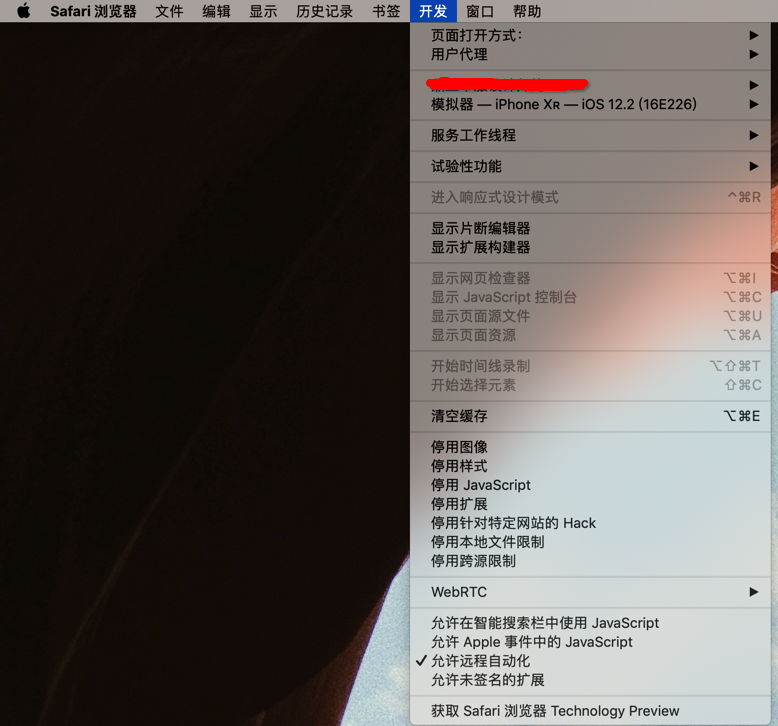

# xzl

将[小专栏](https://xiaozhuanlan.com)的内容通过markdown/pdf格式导出

# 小专栏规则修改, 各位就不要再下载本仓库的内容了
# 我们应该尊重每一位作者的付出， 请不要随意传播下载后的文件

# 使用前请确定已在Chrome中登录过小专栏, 否则可能会出现导出失败的问题

#### 已支持
- <h4>专栏</h4>
- <h4>小书</h4>
- <h4>全部订阅</h4>

#### 导出格式
- <h4>markdown</h4>
- <h4>pdf</h4>

#### 由于获取目录时需要模拟鼠标滑动， 所以请打开Safari的允许远程自动化， 开发->允许远程自动化

### 做 virtualenv 虚拟环境，直接安装全部依赖：

    # 全局安装 virtualenv
    $ pip3 install virtualenv 

    # clone repo
    $ git clone git@github.com:iizvv/xzl.git & cd xzl

    # 创建虚拟环境
    $ virtualenv venv

    # 激活环境
    $ source venv/bin/active

    # 安装依赖
    $ pip3 install -r requirements.txt

    # 执行脚本
    $ python3 xzl.py

- 感谢[瓜神](https://github.com/Desgard)提供的方案
